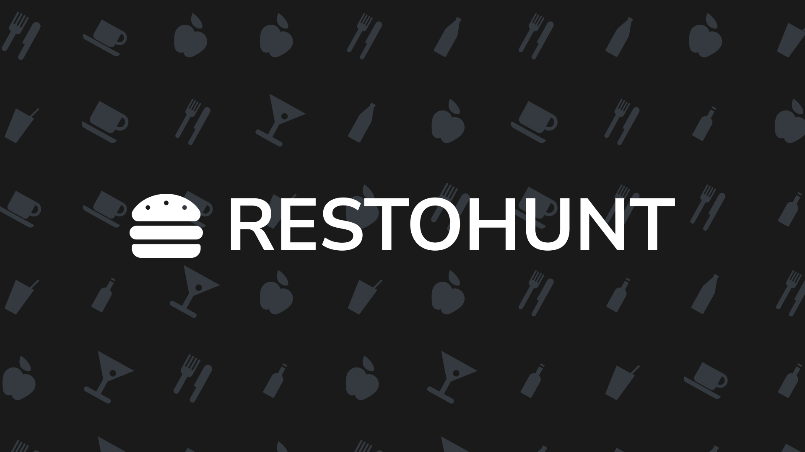

# 🍽️ RestoHunt

Discover neighborhood restaurants with style — powered by static export, modular components, and real-time previews.
[Preview it live here](https://restohunt.netlify.app).



## 📦 Tech Stack

- **Next.js App Router** (v15+)
- **TypeScript**
- **React Bootstrap** for layout
- **FontAwesome** for icons
- **Static JSON Data** via [`/public/data/restaurants.json`](./public/data/restaurants.json)
- **Custom Hooks** (e.g.: [`useRestaurantUtils()`](./src/hooks/data/index.ts#L6))
- **Client/Server Split Routing** with dynamic previews

## 📁 Static Data Source

RestoHunt uses a local JSON file stored at:

```
public/data/restaurants.json
```

To support static generation ([`generateStaticParams()`](./src/app/Preview/[id]/page.tsx#L4)), a build-safe utility reads this file using Node’s filesystem API.

## 🧭 Routing Behavior

- **Home page** lists all restaurants via [`getAll`](./src/hooks/data/index.ts#L19)
- **Preview page** renders details for a single restaurant using route params + [`getById`](./src/hooks/data/index.ts#L20)
- Static export ready with pre-rendered dynamic paths
- Open Graph metadata from [`opengraph-image.jpg`](./src/app/opengraph-image.jpg)

## 🎯 Features

- Modular UI with [`CardLayout`](./src/components/CardLayout/index.tsx), [`HotelCard`](./src/components/HotelCard/), [`OperatingHours`](./src/components/OperatingHours/index.tsx).
- Custom typed hook for structured access ([`useRestaurantUtils()`](./src/hooks/data/index.ts#L6))
- Open Graph metadata image handling
- Static JSON-backed architecture
- Responsive layout

## 🌐 Deployment

### Powered by [Netlify](https://www.netlify.com)

Static export enabled via [`next.config.js → output: "export"`](./next.config.ts#L5)
